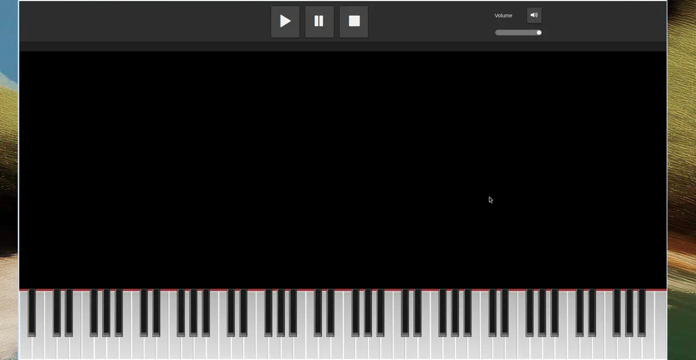

# Midiano — MIDI piano demo

A browser piano-learning app. Open a MIDI file (or a built-in sample), watch notes fall over a virtual keyboard, follow generated sheet music, and play along with a MIDI keyboard.



## Overview

**Midiano** runs entirely in the browser. It visualizes MIDI as falling notes over a piano, generates sheet music automatically, and can wait for you to hit the correct keys in play-along mode. Connect a MIDI keyboard for input and output, or use the on-screen piano.

## Tech stack

| Layer | Technology |
| --- | --- |
| Language | Vanilla JavaScript (ES modules) |
| 3D / particles | [Three.js](https://threejs.org/) |
| Sheet music | [VexFlow](https://www.vexflow.com/) |
| Color picker | [Pickr](https://github.com/Simonwep/pickr) |
| UI | Bootstrap 3 |
| Audio | Web Audio API + MIDI.js soundfonts |
| MIDI devices | Web MIDI API |
| Offline / install | Progressive Web App (service worker + `manifest.json`) |

## Features

- Play any MIDI file or a bundled sample song
- Pause, skip, and change playback speed
- Automatic sheet-music generation
- MIDI keyboard input and output
- Play-along mode that waits for the correct notes
- Sustain-pedal visualization
- Per-track controls (show/hide, instrument, volume)
- Customizable colors, particles, and instruments
- Multiple soundfonts (including an optional HQ piano soundfont)
- Works in modern browsers on desktop and mobile (not Internet Explorer)

## Dependencies

There is **no `package.json`**. Libraries are vendored under `lib/`:

| Library | Path / source | Used for |
| --- | --- | --- |
| Three.js | `lib/three.min.js` | Particle and 3D effects |
| VexFlow | `lib/vexflow-min.js` | Sheet rendering |
| Pickr | `lib/Pickr/` | Color picking in settings |
| Bootstrap 3 | `css/bootstrap*.css` | Layout and UI |
| Base64 helpers | `lib/Base64.js`, `lib/Base64binary.js` | MIDI / audio decoding |

Soundfonts are fetched at runtime from  
[Bewelge/midi-js-soundfonts](https://github.com/Bewelge/midi-js-soundfonts) (requires network on first play).

## Run locally

Because the app uses ES modules, open it through a local HTTP server (not `file://`).

```bash
git clone https://github.com/SalmanAAbir/midi-demo.git
cd midi-demo
python3 -m http.server 8080
```

Then visit http://localhost:8080

Alternatively:

```bash
npx --yes serve .
```

### Notes

- A modern browser is required (Chrome, Firefox, Edge, Safari).
- MIDI hardware needs a browser with [Web MIDI API](https://developer.mozilla.org/en-US/docs/Web/API/Web_MIDI_API) support (Chrome and Edge today).
- First playback downloads soundfont files; keep an internet connection available.

## Links

| | |
| --- | --- |
| Repository | https://github.com/SalmanAAbir/midi-demo |
| Live demo | No public host yet — run locally as above |
| Web Audio API | https://developer.mozilla.org/en-US/docs/Web/API/Web_Audio_API |
| Web MIDI API | https://developer.mozilla.org/en-US/docs/Web/API/Web_MIDI_API |
| Soundfonts | https://github.com/Bewelge/midi-js-soundfonts |
